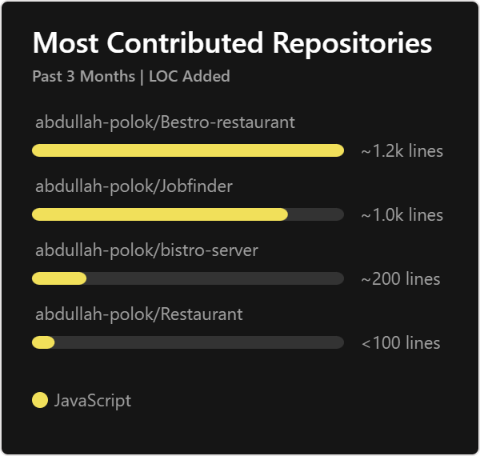

 
 
 

# 💫 Current Overview:
- 🔭 I'm currently working  on Web Development 
- 👯 I'm looking to participate in a hackathon or open-source contribution
- 📫 I would like to  explore new technology
- 😄 I have solved a few problems using C++
- 🌱 I worked as a  social volunteer in the past

- ⚡ I have always liked to talk about information technology

 
 
  

# 💻 Tech Stack:

             

 
 
 

# 📊My Stats:
 
 

 
 
 

## My project Details

 

 
 
 

## 🏆 My GitHub Trophies

 
 
 

## 🌐 My Socials:
    

 
 
 

## ✍️ Random Dev Quote

